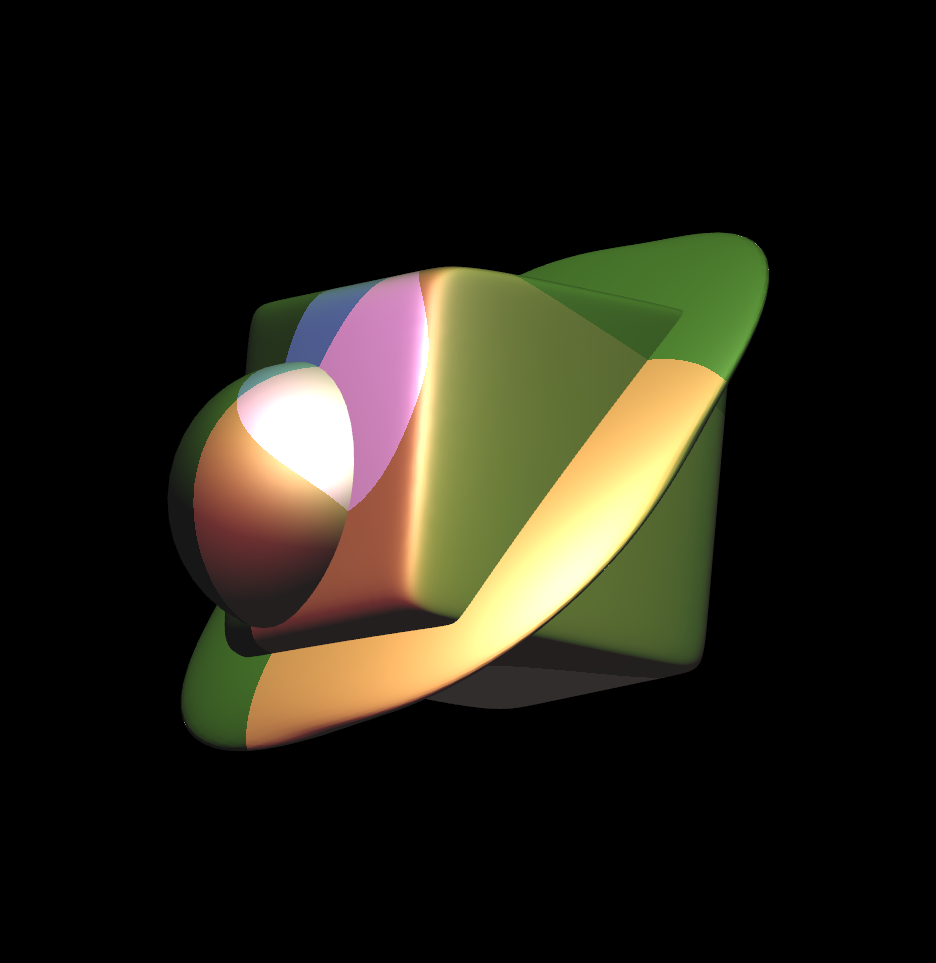
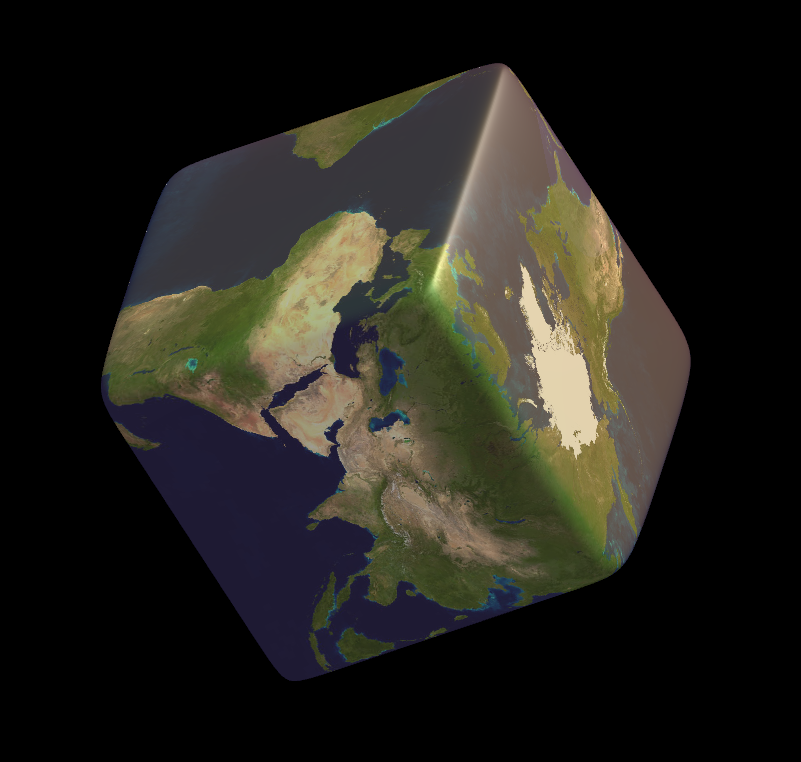
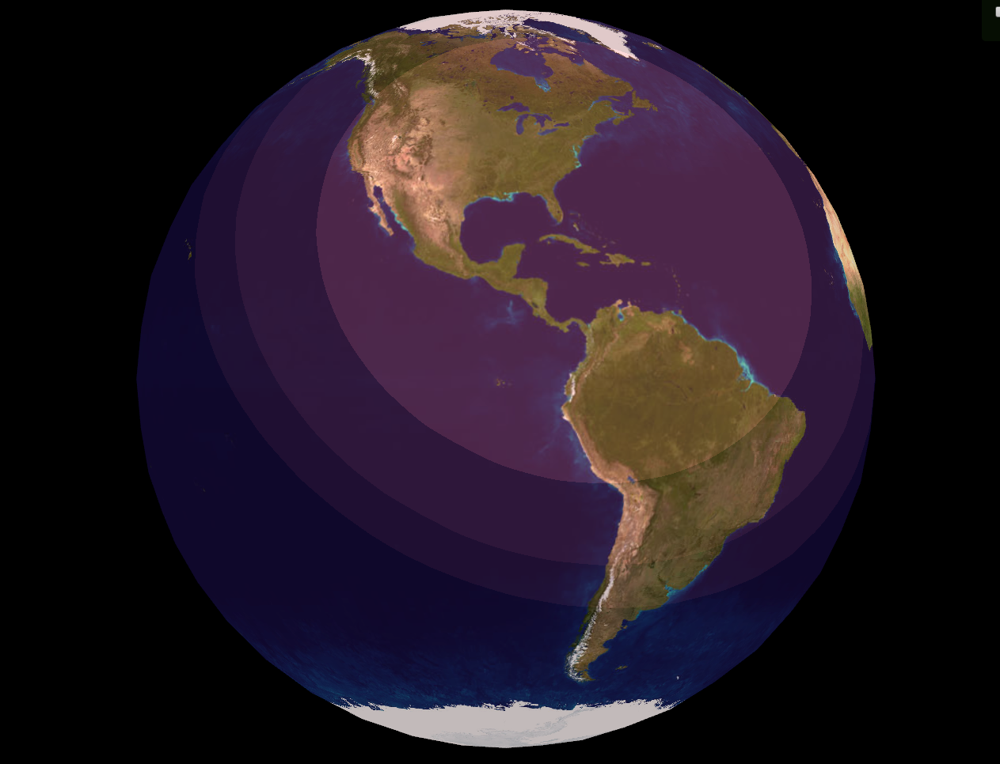
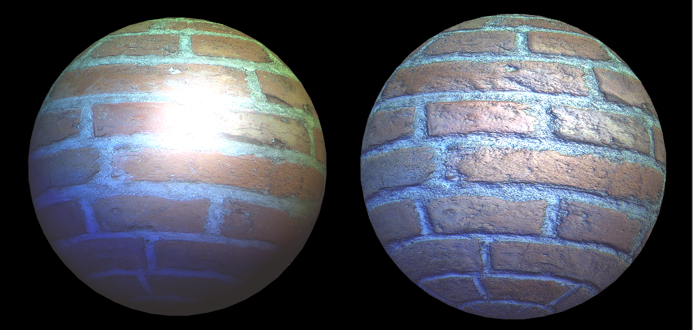
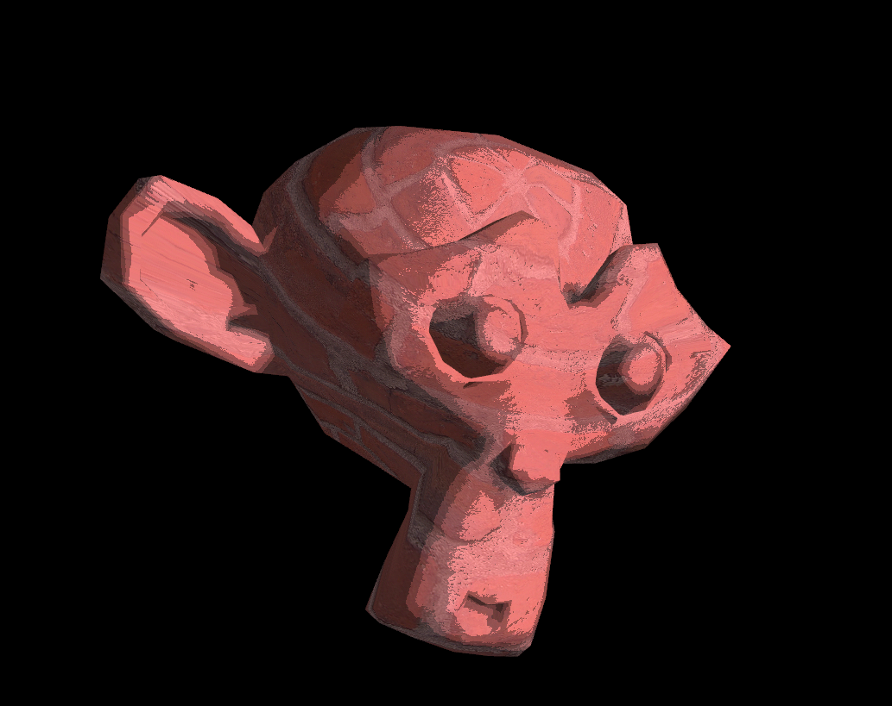

# Z-Buffer Rendering System in OpenGL

OpenGL rendering system that builds a Z-Buffer model that supports triangle meshes, whose appearance is based on shaders (Gouraud, Blinn-Phong, Toon, Environmental), with the possibility of using textures, and effects such as bump mapping. Different light types are supported: Point Light, Directional Light and Spot Light.

| | |
|-|-|
| **Programming language**  | C++ 11 and GLSL |
| **Language**   | English (variables and functions), Catalan (comments) |
| **Authors** | Albert Espín and Pau Sanchez (partially, since the base code was provided by Prof. Anna Puig) |
| **Date**  | Q2 2017  |

## Render Gallery

